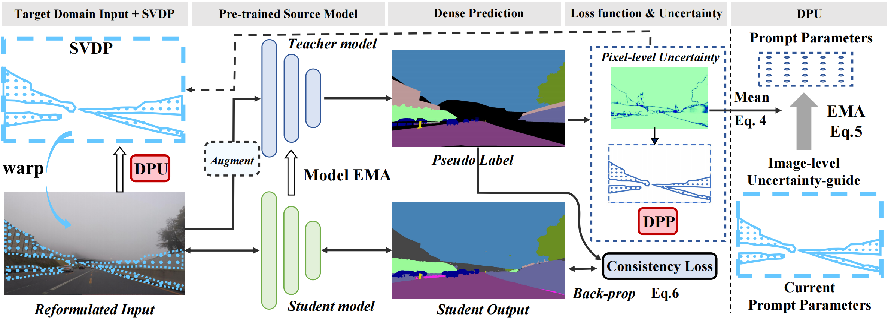

# Exploring Sparse Visual Prompt for Domain Adaptive Dense Prediction (AAAI 2024)
Senqiao Yang, Jiarui Wu, Jiaming Liu, Xiaoqi Li, Qizhe Zhang, Mingjie Pan, Yulu Gan, Zehui Chen, Shanghang Zhang

[[`arXiv`](https://arxiv.org/pdf/2303.09792)] [[`Page`](https://senqiaoyang.com/project/svdp)] [[`BibTeX`](#cite)]

<div align="center">
  
</div><br/>

## Environment setup
```
conda env create -f environment.yml
conda activate svdp
conda install pytorch==1.12.1 torchvision==0.13.1 torchaudio==0.12.1 cudatoolkit=11.6 -c pytorch -c conda-forge
pip install mmcv-full==1.7.1  -f https://download.openmmlab.com/mmcv/dist/cu116/torch1.12/index.html
pip install -r requirements.txt
```

## Prepare Dataset
Please set the acdc data_root in 
```
local_configs/_base_/datasets/acdc_1024x1024_repeat.py
```
## Prepare checkpoint
Our checkpoints are all from [SegFormer](https://github.com/NVlabs/SegFormer)

You could directly download it from [here](
https://drive.google.com/file/d/1T_dBSZRo5Pf_8cBUvbP-4eOREPdP5kt0/view?usp=sharing). 
## Run
```
bash bash/svdp.sh
```
We have provided two sets of example parameters. The results can be found in the 'log'. We also encourage and support users in selecting parameters that best fit their specific tasks when utilizing our work.


## <a name="cite"></a>Citation
Please cite our work if you find it useful.
```bibtex
@inproceedings{yang2024exploring,
      title={Exploring Sparse Visual Prompt for Domain Adaptive Dense Prediction},
      author={Yang, Senqiao and Wu, Jiarui and Liu, Jiaming and Li, Xiaoqi and Zhang, Qizhe and Pan, Mingjie and Gan, Yulu and Chen, Zehui and Zhang, Shanghang},
      booktitle={Proceedings of the AAAI Conference on Artificial Intelligence},
      volume={38},
      number={15},
      pages={16334--16342},
      year={2024}
    }
```